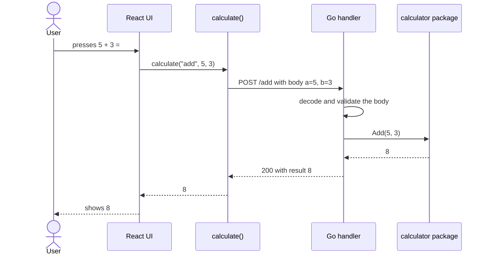

<p align="center">
  
</p>

<h1 align="center">Calculuzz</h1>

<p align="center">
  A full-stack calculator: a React frontend that sends every calculation to a Go REST API.
</p>

<p align="center">
  <a href="frontend/README.md"></a>
  <a href="backend/README.md"></a>
</p>

---

## Quick start

You only need [Docker](https://docs.docker.com/get-docker/) with Compose. From this folder:

```bash
docker compose up --build
```

Then open **http://localhost:5173**. The API is also reachable on **http://localhost:8080**.

Stop everything with `Ctrl+C`, or with `docker compose down` if it runs in the background.

To run each part without Docker (for development), see the [frontend](frontend/README.md) and [backend](backend/README.md) READMEs.

## Configure and deploy with Compose

### Settings

The only settings are the ports published on your machine. Both have defaults, so this step is optional:

```bash
cp .env.example .env   # then edit .env
```

| Variable        | What it does                | Default |
| --------------- | --------------------------- | ------- |
| `FRONTEND_PORT` | Port where you open the app | `5173`  |
| `BACKEND_PORT`  | Port where the API answers  | `8080`  |

### Useful commands

| Command                          | What it does                             |
| -------------------------------- | ---------------------------------------- |
| `docker compose up --build`      | Build the images and start both services |
| `docker compose up -d --build`   | Same, in the background                  |
| `docker compose logs -f backend` | Follow the logs of one service           |
| `docker compose ps`              | List the running services                |
| `docker compose down`            | Stop and remove the containers           |

## How a calculation works



If something fails (division by zero, invalid input, server down), the backend answers with an error message, `calculate()` turns it into an `Error`, and the screen shows it.

## Tests

| Part                 | Coverage                        |
| -------------------- | ------------------------------- |
| Backend · calculator | `████████████████████` **100%** |
| Backend · handlers   | `██████████████████░░` **88%**  |
| Frontend · all files | `███████████████████░` **95%**  |

## Design decisions

### One endpoint per operation, two numbers per request

The API has `POST /add`, `POST /divide`, and so on, each taking `{"a": ..., "b": ...}`. It does not parse expressions like `"2+3*4"`.

- Each endpoint does one thing, so validation and tests stay small and clear.
- Chained input (`2 + 3 ×`) is handled by the frontend, which sends one operation at a time.

### The calculator as a state machine

The frontend keeps the calculator's state in a reducer. While a request is in progress, key presses are ignored, so a calculation can never be sent twice.

### Strict input validation

- A missing number is an error, never treated as `0`: `{"a": 5}` on `/add` fails instead of returning `5`.
- Unknown fields, text instead of numbers, extra data after the JSON and bodies over 1 KB are rejected.
- Results that JSON can't represent (infinity, `NaN`), like `10^400`, return `422` with a clear message instead of a broken response.

### The browser calls the API directly (CORS)

The frontend calls `http://localhost:8080` and the backend allows that origin through CORS. The alternative, an nginx proxy in front of both, would avoid CORS, but this setup works the same way in development (`npm run dev` + `go run`) and in Docker.

Trade-off: the API address is fixed when the frontend image is built.

### Assumptions

- Numbers are 64-bit floats. The screen rounds results to 12 significant digits, so `0.1 + 0.2` shows `0.3`.
- `%` returns `b` percent of `a`: `200 % 15` gives `30`.
- `√` only uses `a`.

<!-- Add your own design decisions below. -->

## AI usage

I used **Claude Code** in VS Code as a code reviewer and pair programmer. I wrote the first version of the backend and of the API connection; Claude reviewed them and helped with tests, the UI, Docker and docs. I reviewed and ran every change before keeping it.

<details>
<summary><strong>Prompts used</strong></summary>

**Backend**

1. Review this Go code and its comments. Focus on readability and maintainability.
2. Verify if this rewrite of the request decoding logic is correct.
3. Write unit tests for the API and math logic, then perform a final code review.
4. Check if this REST API meets all the assignment requirements and list any missing features.
5. Implement CORS, required-field validation, body size limits, and robust server configuration (port, timeouts, and graceful shutdown).

**Frontend**

6. Build a React calculator UI using the 2048 game color scheme and typography. Include a fixed-size display, matching title color, and button shadows.
7. Debug and fix this frontend API connection code.

**Docker and Documentation**

8. Create a Docker Compose file to run the frontend and backend services together.

</details>

## Author

**Juan David Gutierrez Rodriguez** - [GitHub @jdgutirod](https://github.com/jdgutirod)
